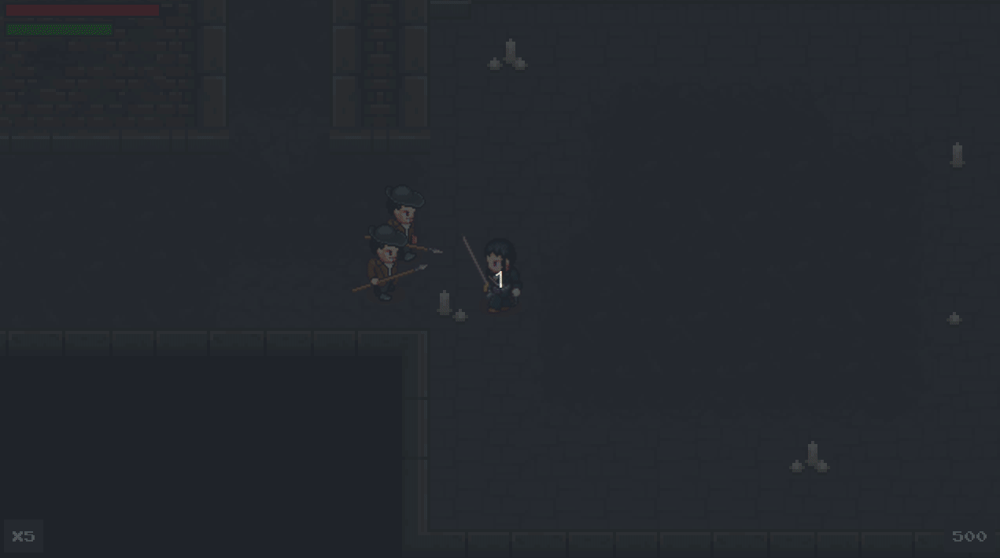

Реализация мини-игры в стиле Dark Souls с использованием библиотеки Pygame. Сразитесь с врагами, используйте способности и очистите карту от противников!

## Установка (Windows)

1. **Скачайте последний релиз**: 
2. **Распакуйте архив** в любую папку
3. **Запустите** `GothicGame.exe`

## Управление и механика

### Основное управление:
| Клавиша | Действие |
|---------|---------|
| WASD    | Перемещение персонажа |
| SPACE   | Атака |
| F       | Лечение |
| LSHIFT  | Ускорение (ролл) |

### Особенности игры:
- Система здоровья и урона
- Ресурсы (энергия для способностей)
- Временная неуязвимость после атаки
- Анимации атаки и перемещения

## Цель игры
Уничтожьте всех врагов на карте, используя:
- Базовые атаки (SPACE)
- Способности лечения (F) и ускорения (LSHIFT)
- Тактическое перемещение

## Скриншоты и геймплей
## Карта

## Анимация игрока 

## Интерфейс игрока

## Анимация врага

## Взаимодействие игрока и противника
